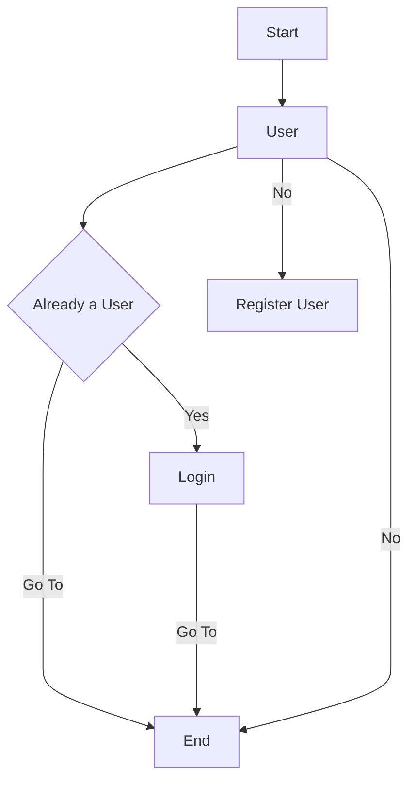

```mermaid
flowchart TD
    A[Start] --> B[User]
    B --> C{Already a User}
    C --> |Yes| D[Login]
    C ----> |Go To| F[End]
    B --> |No| E[Register User]
    D ----> |Go To| F[End]
    B ---->|No| F[End]
```
